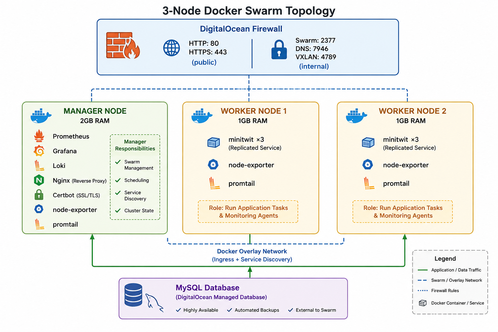

# I-Terroni-DevOps

A modern micro-blogging platform built with **Pyramid**, deployed on **DigitalOcean** using **Docker Swarm**, with fully automated CI/CD, monitoring, and logging.

---

## Description

**I-Terroni-DevOps** is the complete DevOps implementation of ITU-MiniTwit. Users can register, post messages, and follow others. The platform automatically scales with demand, includes real-time monitoring, and deploys with zero downtime.

**What It Does:**
- Multi-user micro-blogging platform
- Scalable 3-node Docker Swarm cluster
- Automated CI/CD with GitHub Actions
- Real-time monitoring (Prometheus + Grafana)
- Centralized logging (Loki)
- Infrastructure as Code (Terraform)
- Automated security & code quality checks

---

## Features

- **User Management** — Register, login, follow/unfollow users
- **Micro-blogging** — Post and view tweets/messages
- **RESTful API** — Full simulator integration support
- **Scalability** — Automatic load balancing across replicas
- **HTTPS** — Automatic certificate management (Let's Encrypt)
- **Zero-downtime Deployments** — Rolling updates with health checks
- **Message Moderation** — Admin tool to flag malicious content
- **Monitoring** — 23 application metrics, 6 Grafana dashboards
- **Testing** — 3-level test pyramid (integration, API, UI)
- **Code Quality** — 5 static analysis tools + SonarCloud integration

---

## Tech Stack

| Layer | Technology |
|-------|-----------|
| **Backend** | Pyramid (Python) + SQLAlchemy ORM |
| **Database** | MySQL 8 |
| **Containers** | Docker + Docker Compose |
| **Orchestration** | Docker Swarm (1 manager + 2 workers) |
| **Infrastructure** | Terraform + DigitalOcean |
| **CI/CD** | GitHub Actions |
| **Monitoring** | Prometheus + Grafana |
| **Logging** | Loki + Promtail |
| **Reverse Proxy** | Nginx + Certbot |
| **Testing** | Pytest + Selenium |

---

## Installation

### Local Development

```bash
# Clone repository
git clone https://github.com/stegish/I-Terroni-DevOps.git
cd I-Terroni-DevOps

# Setup Python environment
python -m venv .venv
source .venv/bin/activate  # Windows: .venv\Scripts\activate

# Install dependencies
pip install -r requirements.txt

# Initialize database
./control.sh init

# Start the full stack
./control.sh start
```

**Access the app:**
- Web UI: http://localhost:8080
- API: http://localhost:8080/api/latest
- Grafana: http://localhost:3000 (admin/admin)
- Prometheus: http://localhost:9090

### Production Deployment

**Prerequisites:**
- DigitalOcean account
- Terraform
- SSH key pair

**Quick Deploy:**

```bash
# 1. Create .env with your secrets
export DO_TOKEN="dop_v1_..."
export TF_VAR_ssh_key_name="your-key"
export TF_VAR_region="fra1"

# 2. Provision infrastructure
cd infrastructure/
terraform apply

# 3. Application auto-deploys via bring-up.sh

# 4. Get manager IP and setup TLS
MANAGER_IP=$(terraform output -raw manager_ip)
ssh root@$MANAGER_IP bash /root/minitwit/scripts/setup-tls.sh your-domain.com

# 5. Access via Grafana SSH tunnel
ssh -L 3000:127.0.0.1:3000 -L 9090:127.0.0.1:9090 root@$MANAGER_IP
```

---

## Usage

### Run Locally

```bash
./control.sh start           # Start services
./control.sh startprod       # Background mode
./control.sh stop            # Stop services
./control.sh init            # Initialize DB
```

### Run Tests

```bash
pytest                                  # All tests
pytest minitwit_tests_refactor.py       # Integration tests
pytest minitwit_sim_api_test.py         # API tests
pytest test_itu_minitwit_ui.py          # UI tests (Selenium)
python simulator/minitwit_simulator.py http://localhost:8080 simulator/minitwit_scenario.csv
```

### Code Quality

```bash
make lint           # Code style checks
make typecheck      # Type checking
make lint-fix       # Auto-format code
make check          # All checks
```

### Admin Tools

**Flag malicious messages:**
```bash
docker run --rm --env-file /root/minitwit/.env michaelfant/minitwitimage:latest python flag_tool.py 123 456
```

**Export all messages:**
```bash
docker run --rm --env-file /root/minitwit/.env michaelfant/minitwitimage:latest python flag_tool.py -i > messages.csv
```

### Monitor Production

```bash
# SSH into manager
ssh root@<manager-ip>

# Check services
docker service ls
docker service ps minitwit_stack_minitwit

# View logs
docker service logs -f minitwit_stack_minitwit | head -50

# Access Grafana dashboards (via SSH tunnel)
ssh -L 3000:127.0.0.1:3000 root@<manager-ip>
# Then browse: http://localhost:3000
```

---

## Architecture

### 3-Node Docker Swarm Topology


*AI-generated topology diagram*

### Why This Architecture?

| Design | Reason |
|--------|--------|
| **3-node cluster** | Isolates observability from app, prevents memory exhaustion |
| **Docker Swarm** | Built-in DNS service discovery; simpler than Kubernetes at this scale |
| **Terraform** | Reproducible infrastructure, state tracking |
| **GitHub Actions** | Native GitHub integration, no external CI/CD needed |
| **Prometheus + Grafana** | Industry standard, 11 custom application metrics |
| **Loki** | Lightweight logging, scales on manager node |

---

## Monitoring

**11 Application Metrics:**
- HTTP requests, latency (p50/p95/p99), error rates
- Database query performance
- User & message counts
- Follow relationships

**6 Grafana Dashboards:**
1. Business metrics (users, messages, engagement)
2. API performance (requests, latency, errors)
3. System health (CPU, memory, disk per node)
4. Infrastructure (service health, replicas)
5. Database (queries, connections, performance)
6. Logs (full-text search via Loki)

**Access Dashboards:**
```bash
ssh -L 3000:127.0.0.1:3000 root@<manager-ip>
# http://localhost:3000 (admin / <password from .env>)
```

---

## Testing

### Test Pyramid

```
         UI Tests (Selenium)
        /                \
   API Tests        Integration Tests
 (Simulator)        (HTTP requests)
```

**Run Tests:**
```bash
pytest                                  # All
pytest minitwit_tests_refactor.py       # Integration
pytest minitwit_sim_api_test.py         # API
pytest test_itu_minitwit_ui.py          # UI
make check                              # Full CI check locally
```

---

## Deployment Pipeline

```
git push → GitHub Actions
  ├─ Static analysis (ruff, mypy, shellcheck, codespell)
  ├─ Tests (pytest + Selenium)
  ├─ Security scan (Trivy)
  └─ Deploy to production (docker stack deploy)
```

**Automatic rollback** if deployment fails. Manual rollback via `git revert + git push`.

---

## Operations

### Common Tasks

**Scale up (add workers):**
```bash
# Edit infrastructure/variables.tf: worker_count = 3
terraform apply
docker service update --force minitwit_stack_minitwit
```

**View logs:**
```bash
ssh root@<manager-ip>
docker service logs -f minitwit_stack_minitwit | tail -100
```

**Restore Grafana backup:**
```bash
# Full procedure in extended documentation
docker service update --mode replicated --replicas 0 minitwit_stack_grafana
# (restore via docker volume copy)
docker service update --mode replicated --replicas 1 minitwit_stack_grafana
```

### Troubleshooting

| Issue | Fix |
|-------|-----|
| App won't start | `docker service logs minitwit_stack_minitwit` |
| High latency | Check Grafana dashboard 02-api-http & database performance |
| Disk full | `df -h` → `docker image prune -a` |
| DB connection fails | Verify `DATABASE_URL` in .env & MySQL instance in DO console |

---

## Contributing

This project is developed by:
- **Michael Fantinato**
- **Vincenzo Sabino**
- **Gabriele Matteoli**
- **Rachele Russo**
- **Benedek Szabo**


---


## Acknowledgments

- **ITU MSc "DevOps, Software Evolution and Software Maintenance"** course
- **Pyramid**, **Docker**, **Terraform**, **Prometheus**, **Grafana** communities
- TAs: Babette, Patrick, Talha
- LLM-s

---

## Quick Links

- **GitHub:** [I-Terroni-DevOps](https://github.com/stegish/I-Terroni-DevOps)
- **Docker Images:** [michaelfant/minitwitimage](https://hub.docker.com/r/michaelfant/minitwitimage)
- **Live Status:** [Simulator Dashboard](http://138.68.85.121/status.html)
- **Course:** [ITU MSc Lecture Notes](https://github.com/itu-devops/MSc_lecture_notes)

---


> **Note:** Portions of this codebase were generated or optimized using LLMs. All logic has been reviewed and tested for accuracy and security.
