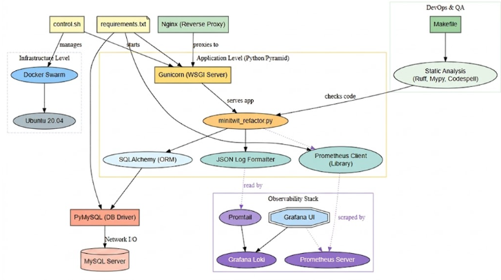

# MSc DevOps, Software Evolution and Software Maintenance — Final Report

**Group i — *I-Terroni-DevOps***
**Members:** Michael Fantinato, Vincenzo Sabino, Gabriele Matteoli, Rachele Russo, Benedek Szabo
**Repository:** <https://github.com/stegish/I-Terroni-DevOps>
**Date:** May 2026

---

## Linked Artifacts

| Artifact | Link / Location |
| --- | --- |
| Main repository | <https://github.com/stegish/I-Terroni-DevOps> |
| Issue tracker | <https://github.com/stegish/I-Terroni-DevOps/issues> |
| Production application | `http://164.92.231.30/public` (DigitalOcean) |
| CI/CD pipelines | [`.github/workflows/continuous-deployment.yml`](../.github/workflows/continuous-deployment.yml), [`.github/workflows/code-quality.yml`](../.github/workflows/code-quality.yml), [`.github/workflows/build-report.yml`](../.github/workflows/build-report.yml) |
| Container images | `michaelfant/minitwitimage:latest`, `michaelfant/flagtoolimage:latest` on Docker Hub |
| Infrastructure as Code | [`infrastructure/`](../infrastructure/) [`docs/infrastructure-as-code.md`](../docs/infrastructure-as-code.md) |
| Security report | [`SECURITY.md`](../SECURITY.md) |
| Grafana dashboards |  [`monitoring/grafana/dashboards/`](../monitoring/grafana/dashboards/) |
| Code-quality dashboards | SonarCloud + Codacy projects |

---

## 1. System's Perspective

### 1.1 Design and Architecture

*ITU-MiniTwit* is a Twitter-like micro-blogging service that we rewrote from the given Flask + raw-SQL code base into a **Pyramid** application with  **SQLAlchemy ORM** data layer. The web framework choice is documented in [`README.md`](../README.md): We chose Pyramid instead of Bottle or Flask because it gave us a clearer structure for the application. Bottle would have required more manual setup for things like templating, while Flask often depends on global application state. Pyramid uses an explicit request object, which made it easier for us to attach things like the database session to `request.db`. This also made the code easier to test, since individual request handlers could be tested without needing to rely on a full application context.

In production the system is a **3-node Docker Swarm** running on DigitalOcean droplets:

- **1 manager** (`s-2vcpu-2gb`): hosts the observability stack (Prometheus, Grafana, Loki) and the nginx ingress. It is deliberately kept off the application path so the app and the telemetry never compete for RAM.
- **2 workers** (`s-1vcpu-1gb` each): run **3 `minitwit` replicas** (Pyramid + 3 gunicorn workers each) plus the `flagtool` admin container.
- Per-node agents (`node-exporter`, `cadvisor`, `promtail`): run in Swarm `mode: global` one task per droplet.

The database runs as a separate DigitalOcean Managed MySQL 8 instance outside the Docker Swarm. The application connects to it through the `DATABASE_URL` environment variable, using TLS for the connection. On the manager node, nginx handles HTTPS traffic and forwards requests into the Swarm network to the MiniTwit service through Swarm DNS (`tasks.minitwit:5000`). We also use this DNS-based service discovery for monitoring, so Prometheus can scrape the actual running replicas instead of only reaching one container through a single load-balanced address.


Deployment safety is enforced through a mandatory healthcheck: each replica runs a Python `urllib` probe every 10 seconds, with a 20-second grace period before Swarm considers the container ready. This prevents the `start-first` rolling strategy from terminating an old replica before the new one is fully initialized and accepting connections. Additionally, services declare varying restart policies: the main application uses `condition: any` (restart on all exits), while observability and utility services use `condition: on-failure` with exponential backoff (delay, max_attempts, window), allowing graceful shutdown and containment of transient failures.

### 1.2 Dependencies

| Layer | Tooling |
| --- | --- |
| Language / runtime | Python 3.12-slim |
| Web framework | Pyramid + `pyramid_jinja2` (templating) |
| WSGI server | gunicorn (3 workers × 2 threads) |
| ORM / DB driver | SQLAlchemy + PyMySQL |
| Database | MySQL 8 (DigitalOcean Managed external instance, TLS connection via `DATABASE_URL` environment variable); SQLite in CI |
| Frontend | server-rendered Jinja2 templates + static CSS |
| Observability | Prometheus 2.55, Grafana 11.4, Loki 2.9, Promtail 3.0, `node-exporter` 1.8, cAdvisor 0.49, `mysqld-exporter` 0.14.0, `prometheus-client`; per-node agents run `mode: global` with resource caps to prevent interference with application workloads |
| Reverse proxy / TLS | nginx 1.27-alpine + Let's Encrypt (certbot) |
| Container orchestration | Docker Engine + Docker Swarm (compose-spec) |
| Infrastructure as Code | **Terraform** (DigitalOcean provider); `Vagrantfile` kept for single-node local experiments only |
| CI/CD | GitHub Actions; Docker Hub registry |
| Static analysis | `ruff`, `codespell`, `mypy`, `hadolint`, `shellcheck` |
| Security scanning | Semgrep (SAST), Trivy (image CVEs), SonarCloud, Codacy |
| Browser E2E tests | Selenium (standalone-chrome) |



Figure 1.2.1: Dependency graph: logical view

The full dependency manifest is in [`requirements.txt`](../requirements.txt) and the lint/format/type-check configuration in [`pyproject.toml`](../pyproject.toml). The CI image is built from [`Dockerfile-minitwit-tests`](../Dockerfile-minitwit-tests) and never reaches production, keeping test dependencies and debug code out of `michaelfant/minitwitimage:latest`.

### 1.3 Current state, static analysis & quality assessment

Quality is continuously measured by two third-party services hooked to every push and PR (workflow: [`.github/workflows/code-quality.yml`](../.github/workflows/code-quality.yml)):

- **SonarCloud** reports maintainability, reliability and security ratings, duplications, cyclomatic complexity and the SQALE technical-debt index.
- **Codacy** provides an aggregated grade combining `ruff`, `pylint`, `bandit`, `hadolint` and `shellcheck`.

At hand-in time both projects sit at a passing quality gate. Local linting passes cleanly (`make check`), `ruff format --check` is green, and the latest `Trivy` scan of `michaelfant/minitwitimage:latest` reports no HIGH/CRITICAL findings with `ignore-unfixed: true` (the gate that blocks deploy). `mypy` runs non-blocking and surfaces residual type gaps in legacy modules.

---

## 2. Process' Perspective

### 2.1 CI/CD pipeline

The pipeline operates in [`.github/workflows/continuous-deployment.yml`](../.github/workflows/continuous-deployment.yml) and is structured as four sequential jobs, each a hard gate for the next:

```
static-analysis  →  tests  →  security-scan  →  build-and-deploy
```

1. **`static-analysis`**: `ruff` (lint + format), `codespell`, `mypy` (non-blocking), `hadolint` on the three Dockerfiles, `shellcheck` on `control.sh`/`deploy.sh`, and **Semgrep SAST** with the `p/security-audit`, `p/owasp-top-ten`, `p/python` and `p/dockerfile` rule packs, failing the build on findings of severity ≥ ERROR.
2. **`tests`**: builds the production image locally, spins up MySQL 8 + Selenium Chrome on a Docker network, runs the schema init (mirroring `deploy.sh`), and then executes the three test suites: integration (`minitwit_tests_refactor.py`), simulator API (`minitwit_sim_api_test.py`) and Selenium (`test_itu_minitwit_ui.py`).
3. **`security-scan`**: **trivy** scans the built image for OS-package and Python-dependency CVEs and fails on HIGH/CRITICAL. Results are also uploaded as SARIF to the GitHub Security tab.
4. **`build-and-deploy`**: only runs on `push` to `main` (not on PR). Pushes the two production images to Docker Hub and SSH into the manager droplet to run `deploy.sh`, which uses `docker stack deploy` with a rolling update.

**Infrastructure** is provisioned  with **Terraform** ([`infrastructure/main.tf`](../infrastructure/main.tf)). Remote-exec provisioners automate `docker swarm init` on the manager and `docker swarm join` on workers using a join token retrieved via SSH.


The deploy itself  does three important things beyond `docker stack deploy`: it computes a `sha256` hash of the nginx config and promtail config and injects them as labels / Swarm config names so that a config-only change reliably triggers a rolling restart, and it runs `init_db()` exactly once in a container.

### 2.2 Monitoring

We collect metrics with Prometheus and visualise them in six domain oriented Grafana dashboards (`01-business`, `02-api-http`, `03-system-health`, `04-infrastructure`, `05-database`, `06-logs`), provisioned automatically from [`monitoring/grafana/dashboards/`](../monitoring/grafana/dashboards/).

**What we monitor:**

- **Business**: total users, total messages, total follow relations, average followers, registration/message rate, derived from in-app gauges in [`metrics.py`](../metrics.py).
- **API / HTTP**: request count by `method × route × status`, latency histogram, 4xx/5xx rates, error budget burn.
- **System health**: droplet CPU, memory, disk and network from `node-exporter`; per container CPU/RAM/IO from cAdvisor.
- **Infrastructure**: per droplet resource health (CPU, memory, disk, network utilization, load average) with per node breakdowns and thresholds.
- **Database**: InnoDB metrics, process list, query throughput, table-lock waits from `mysqld-exporter` against the DO managed MySQL.
- **Logs**: Loki query panels showing 5xx bursts and recent error lines.

Prometheus discovers replicas via Swarm overlay DNS (`tasks.minitwit`, `tasks.node-exporter`, `tasks.cadvisor`) so every replica/agent is scraped. TSDB retention is capped at **7 days or 512 MB**, whichever comes first, so the manager droplet never runs out of disk.

### 2.3 Logging

`Promtail` runs and tags each line with the container name and delivers to Loki on the manager (see [`logging/promtail-config.yml`](../logging/promtail-config.yml)). The application uses `json-log-formatter` so stdout lines are structured JSON, which makes Loki labels actually useful. Retention is 7 days, enforced by the Loki compactor. Grafana's "06-logs" dashboard exposes a small LogQL toolbox for quick incident triage.

### 2.4 Security hardening

A full risk assessment + mitigation plan can be found in [`SECURITY.md`](../SECURITY.md). Headline items, all implemented in this branch:

- **Firewall defense in depth.** Docker rewrites `iptables` and bypasses `ufw`, so we layered two controls: (a) ufw on the host (allows only 22/80/443) and (b) DigitalOcean cloud firewall declared in [`infrastructure/firewall.tf`](../infrastructure/firewall.tf). Internal ports (Prometheus 9090, Grafana 3000, Loki 3100) are reached over SSH tunnels only.
- **TLS** via nginx + Let's Encrypt; all external traffic is HTTPS-only, but internal traffic between nginx and the app is plain HTTP (HTTP redirects to HTTPS); renewal is in cron.
- **Non-root containers.** All three Dockerfiles add a dedicated `appuser` and `USER appuser` before `CMD`.
- **Secrets out of source.** Removed hard-coded simulator credentials and the default Pyramid `SECRET_KEY`; both are now required env vars that crash the app on startup if missing.
- **Image base bump** `python:3.9-slim` → `python:3.12-slim`.
- **Shift-left in CI:** Semgrep (SAST) and Trivy (image CVE) gate the deploy.
- **Third-party Actions pinned by commit SHA** (e.g. `SonarSource/sonarcloud-github-action@ffc3010689...`) so a hijacked tag can't exfiltrate workflow secrets.

### 2.5 Availability and scaling

Availability comes from three layers:

1. **Replica horizontality.** `minitwit` runs as 3 Swarm replicas, so a worker droplet can die and Swarm keeps at least one replica serving on the survivor. The `update_config: { order: start-first }` guarantees we never go below 3 replicas during a rolling deploy.
2. **Resource limits.** Every service declares both `reservations` and `limits` (e.g. `minitwit` 128 MB reserved / 256 MB cap). A misbehaving container cannot run the droplet out of memory.
3. **Stateful services.** Prometheus, Grafana and Loki are pinned to the manager (`node.role == manager`) so their named volumes always re-attach to the same host.

If we need more capacity, we just update the `worker_count` variable in Terraform to scale horizontally or to spin up more droplets, then use `docker service scale minitwit_stack_minitwit=N` to add more copies of the app.

---

## 3. Reflection Perspective

### 3.1 Evolution and refactoring

The largest single refactor was **introducing SQLAlchemy** ([`db.py`](../db.py), [`models.py`](../models.py), and the new [`minitwit_refactor.py`](../minitwit_refactor.py)). The original code interleaved raw `SELECT * FROM user WHERE id=?` with HTTP handler logic; changing database engine would have meant rewriting every endpoint. We split it into three layers — a thin connection module (`db.py`), declarative ORM models (`models.py`) and pure-business-logic handlers — which then made the **SQLite → MySQL 8 migration** a no-op at the code level: only the `DATABASE_URL` connection string changed. SQLite is still used in CI for speed; SQLAlchemy abstracts the engine so the same tests run in both places.

A second major evolution was **splitting one monolithic Dockerfile into three** (`Dockerfile-minitwit`, `Dockerfile-flagtool`, `Dockerfile-minitwit-tests`). Each image now has a different lifecycle: production, admin utility, and CI-only. The test image carries Selenium, `pytest` and curl; none of that reaches production, which reduced the deployed image and removed several false-positive CVEs reported by Trivy.

The third evolution was **infrastructure**: we moved from `vagrant up --provider=digital_ocean` (good enough for a single VM) to a **Terraform-managed swarm** of three droplets when we hit the limits of one box. The rationale, trade-offs, and the `remote-exec` "leaky abstraction" we accepted are written up in `docs/infrastructure-as-code.md`.

### 3.2 Operation

The biggest operational lesson was a **production outage** that taught us *DDL is a deploy-time concern, not a runtime concern*. The full timeline is in `Incident Report_ Simulator API Errors Post-Database Migration-1.pdf`. Summary: `db.py` originally called `init_db()` at module import, which was fine for one process and one SQLite file. After the move to MySQL with **3 replicas × 3 gunicorn workers = up to 9 processes** all racing through `Base.metadata.create_all()` during a `start-first` rolling deploy, MySQL started raising error **1684** (*"table definition is being modified by concurrent DDL"*). Replicas crashed, Swarm flapped, the simulator hammered the API and we saw waves of 500s. The fix was to **lift schema init out of the app boot path** into a one-shot step in `deploy.sh` (and mirror it in the CI test job), exactly the pattern Alembic/Flyway/Liquibase already follow. The rule we wrote down for ourselves: *the application image must never run migrations on startup.*

A second operational lesson came from the observability stack itself. The first iteration bound Grafana/Prometheus/Loki to `0.0.0.0` with `mode: host`, which under Docker's iptables rewrite made them reachable from the public internet despite `ufw` rules. The "Loki / Elasticsearch-style ransom" risk (`SECURITY.md` §R16) was real until we added the DigitalOcean cloud firewall at the cloud edge as a second layer.

### 3.3 Maintenance

Maintenance has been kept tractable by **making everything checkable locally**: `make lint`, `make typecheck` and `make check` mirror the CI quality gate, so a developer can know in seconds whether a PR will land. We also pinned every third-party GitHub Action to a 40-character SHA after Codacy flagged the mutable `@master` / `@v4` refs. The side-effect — Codacy's secret-scanner pattern-matching the SHA as an API key — was handled by excluding `.github/workflows/**` from Codacy, with the trade-off documented in `README.md` §11.

### 3.4 "DevOps" style of work

Compared with previous coursework, three things felt categorically different:

- **Everything is in the repository.** Infrastructure (Terraform), deployment (`deploy.sh`), monitoring (Grafana JSON dashboards), security posture (`SECURITY.md`), even the linter config — all of it is versioned. No "ask the person who last deployed it." The merge of `develop` into `main` is the deploy.
- **Failures push policy back into the pipeline.** When the MySQL DDL race bit us we did not add a runbook ("if you see error 1684, restart the service"); we deleted the failure mode by moving schema init into the pipeline. Same with security: Semgrep + Trivy + SonarCloud + Codacy mean a regression is a red PR check, not a meeting.
- **Pair / trunk-based flow.** Most work landed via short-lived `develop` → `main` PRs with the bot-driven quality gates as the reviewers of first resort. The Git history shows ~160 commits across five authors with frequent merges, which would have been impossible without the pipeline catching obvious regressions for us.

---

## 4. Use of Generative AI

In accordance with ITU's guidelines on the use of generative AI for assessed work, we disclose the following.

**Tools used.** Claude (Anthropic) and Gemini - primarily Claude. Both were used as pair-programming and writing assistants, not as autonomous agents: every diff went through human review and the CI quality gate before merging.

**Where they helped.**

- **YAML and shell.** First drafts of `docker-compose.yml` placement constraints, Prometheus DNS-SD scrape configs, Grafana dashboard JSON skeletons and the `deploy.sh` hashing logic were AI-assisted, then audited line-by-line.
- **Documentation and report.** The structure of `SECURITY.md`, of `docs/infrastructure-as-code.md` and of this report was drafted with an LLM and then revised against the actual source files. Wording polish and consistency checks were AI-assisted.
- **Bug diagnosis.** Thruought the process we faced some database errors and docker firewall issues that were diagnosed faster by walking an LLM through the symptoms and asking it to enumerate hypotheses and solutions; 

**Co-authorship.** LLM tooling is registered as co-author `LLM <none>` in `.mailmap` per the assignment instructions.

---

*Word count: ~2,300 words (excluding tables, code blocks, headings and front-matter).*
